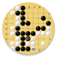

## 
# GoDroid
## Fork of the original [GOdroid](https://sourceforge.net/projects/godroid/) by Andreas Grothe
The game of Go is one of my favorites.  I love being able to just play a game on my phone, but the classic GOdroid, after 12 years, is no longer supported.  So I updated it.

Fixing all of the deprecate API calls, making some edits to and recompiling GnuGo, fixing various odds and ends, and even adding a few new features.  It is now ready for the next decade.  

Major features include:
- Play against a human sitting next to you or GnuGo
- Japanese and Chinese rules
- 9x9, 13x13 and 19x19 boards
- Great touch controls for playing stones
- Save and load SFG's
- Localizted to many languages (some translations were made with ChatGPT)

Besides updating API calls, recently added features are:
- Disallowing the AI from resigning
- Delaying the AI by some seconds (I don't like the games feeling frantic)

I am not an Android developer, but I was able to fumble through the updaets that were needed.  If anyone has requests for new features, I'll do what I can.  Likewise, if anyone wants to fork this library, go right ahead, but I would also be willing to share this repo with you.